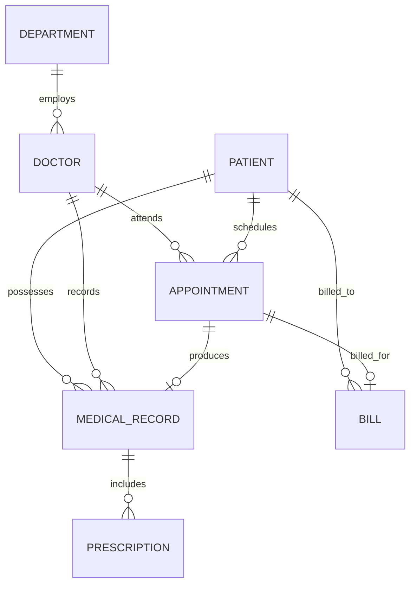

# HOSPITAL PATIENT RECORD SYSTEM
**Oracle Centre of Excellence (COE) Academic Project — Step 1: Database Architecture & Implementation**

---

## 1. Project Title
**Hospital Patient Record System (HPRS)**

---

## 2. Project Objective
The primary objective of this project is to design, implement, and verify a normalized relational database in **Oracle Database** for managing hospital patient records. 

The system focuses strictly on relational core fundamentals:
- Relational schema modeling & 3NF normalization
- Primary keys, Foreign keys, Unique constraints, and Check constraints
- High-efficiency multi-table JOINs (INNER and LEFT JOIN)
- Aggregation, grouping, and filtering using `GROUP BY`, `HAVING`, and nested subqueries
- Reusable abstraction via Database Views
- Procedural business logic using Oracle PL/SQL (Procedures and Functions)
- Robust data integrity validation

---

## 3. Problem Statement
Hospitals routinely deal with high volumes of patient consultations, medical histories, prescriptions, and billing. Without a centralized relational database:
1. Patient medical histories get fragmented across visits.
2. Appointment scheduling and doctor allocation lead to conflicts or lost tracking.
3. Billing records fail to correlate accurately with completed visits and prescribed treatments.
4. Data integrity issues arise from invalid references, negative monetary entries, or inconsistent status values.

The **Hospital Patient Record System** resolves these issues by implementing a centralized, normalized Oracle database enforcing ACID compliance and declarative business constraints.

---

## 4. Text-Based Entity-Relationship (ER) Diagram

```text
+-------------------+             +--------------------+
|    DEPARTMENT     | 1         * |       DOCTOR       |
|-------------------|-------------|--------------------|
| PK department_id  |             | PK doctor_id       |
|    department_name|             |    doctor_name     |
|    location       |             |    specialization  |
+-------------------+             |    phone           |
                                  |    email (UNIQUE)  |
                                  | FK department_id   |
                                  +--------------------+
                                             | 1
                                             |
                                             | *
+-------------------+             +--------------------+
|      PATIENT      | 1         * |    APPOINTMENT     |
|-------------------|-------------|--------------------|
| PK patient_id     |             | PK appointment_id  |
|    patient_name   |             | FK patient_id      |
|    date_of_birth  |             | FK doctor_id       |
|    gender (CHECK) |             |    appointment_date|
|    phone          |             |    appointment_time|
|    email (UNIQUE) |             |    reason          |
|    address        |             |    status (CHECK)  |
|    blood_group(CK)|             +--------------------+
|    created_at     |                       | 1
+-------------------+                       |
        | 1        | 1                      | 0..1
        |          |                        v
        |          |              +--------------------+
        |          |            * |   MEDICAL_RECORD   |
        |          +--------------|--------------------|
        |                         | PK record_id       |
        |                         | FK patient_id      |
        |                         | FK doctor_id       |
        |                         | FK appointment_id  |
        |                         |    diagnosis       |
        |                         |    treatment       |
        |                         |    record_date     |
        |                         |    notes           |
        |                         +--------------------+
        |                                   | 1
        |                                   |
        |                                   | *
        |                         +--------------------+
        |                         |    PRESCRIPTION    |
        |                         |--------------------|
        |                         | PK prescription_id |
        |                         | FK record_id       |
        |                         |    medicine_name   |
        |                         |    dosage          |
        |                         |    frequency       |
        |                         |    duration_days   |
        |                         +--------------------+
        |
        | 1
        |
        v *
+--------------------+
|        BILL        |
|--------------------|
| PK bill_id         |
| FK patient_id      |
| FK appointment_id  |
|    bill_date       |
|    consultation_fee|
|    medicine_fee    |
|    total_amount    |
|    payment_status  |
+--------------------+
```

### Mermaid Architecture Diagram


---

## 5. List of Database Tables & Column Specifications

### Table 1: `DEPARTMENT`
- **Purpose**: Catalogs hospital departments and clinical wings.
- **Primary Key**: `department_id` (NUMBER, Identity)
- **Foreign Keys**: None
- **Constraints**:
  - `department_name`: `VARCHAR2(50) NOT NULL UNIQUE`
  - `location`: `VARCHAR2(100) NOT NULL`

### Table 2: `DOCTOR`
- **Purpose**: Stores doctor credentials, specializations, contact details, and department linkage.
- **Primary Key**: `doctor_id` (NUMBER, Identity)
- **Foreign Keys**: `department_id` -> `DEPARTMENT(department_id)`
- **Constraints**:
  - `doctor_name`: `VARCHAR2(100) NOT NULL`
  - `specialization`: `VARCHAR2(100) NOT NULL`
  - `phone`: `VARCHAR2(15) NOT NULL`
  - `email`: `VARCHAR2(100) NOT NULL UNIQUE`

### Table 3: `PATIENT`
- **Purpose**: Stores master demographic data, contact info, and medical classification.
- **Primary Key**: `patient_id` (NUMBER, Identity)
- **Foreign Keys**: None
- **Constraints**:
  - `gender`: `CHECK (gender IN ('MALE', 'FEMALE', 'OTHER'))`
  - `blood_group`: `CHECK (blood_group IN ('A+', 'A-', 'B+', 'B-', 'AB+', 'AB-', 'O+', 'O-'))`
  - `email`: `VARCHAR2(100) NOT NULL UNIQUE`
  - `created_at`: `DATE DEFAULT SYSDATE NOT NULL`

### Table 4: `APPOINTMENT`
- **Purpose**: Tracks doctor-patient consultation sessions, scheduled timestamps, and operational status.
- **Primary Key**: `appointment_id` (NUMBER, Identity)
- **Foreign Keys**:
  - `patient_id` -> `PATIENT(patient_id)`
  - `doctor_id` -> `DOCTOR(doctor_id)`
- **Constraints**:
  - `status`: `CHECK (status IN ('SCHEDULED', 'COMPLETED', 'CANCELLED'))` (Default: `'SCHEDULED'`)

### Table 5: `MEDICAL_RECORD`
- **Purpose**: Maintains clinical diagnoses, treatment regimens, visit dates, and physician remarks.
- **Primary Key**: `record_id` (NUMBER, Identity)
- **Foreign Keys**:
  - `patient_id` -> `PATIENT(patient_id)`
  - `doctor_id` -> `DOCTOR(doctor_id)`
  - `appointment_id` -> `APPOINTMENT(appointment_id)`

### Table 6: `PRESCRIPTION`
- **Purpose**: Details pharmacotherapy prescribed during a medical consultation.
- **Primary Key**: `prescription_id` (NUMBER, Identity)
- **Foreign Keys**: `record_id` -> `MEDICAL_RECORD(record_id)`
- **Constraints**:
  - `duration_days`: `CHECK (duration_days > 0)`

### Table 7: `BILL`
- **Purpose**: Stores financial transactions, breakdown of doctor and pharmacy fees, and payment status.
- **Primary Key**: `bill_id` (NUMBER, Identity)
- **Foreign Keys**:
  - `patient_id` -> `PATIENT(patient_id)`
  - `appointment_id` -> `APPOINTMENT(appointment_id)`
- **Constraints**:
  - `consultation_fee`: `CHECK (consultation_fee >= 0)`
  - `medicine_fee`: `CHECK (medicine_fee >= 0)`
  - `total_amount`: `CHECK (total_amount >= 0)`
  - `payment_status`: `CHECK (payment_status IN ('PAID', 'PENDING'))` (Default: `'PENDING'`)

---

## 6. Important SQL Concepts Demonstrated

| Concept | Demonstrated In | Description |
| :--- | :--- | :--- |
| **DDL & Constraints** | `01_schema_ddl.sql` | `CREATE TABLE`, `PRIMARY KEY`, `FOREIGN KEY`, `CHECK`, `NOT NULL`, `UNIQUE` |
| **DML** | `02_sample_data.sql` | `INSERT INTO`, `DELETE FROM`, `TO_DATE()`, `SYSDATE` |
| **Multi-Table JOINs** | Queries 2, 4, 5, 6, 7, 8, 15, 16 | `INNER JOIN` across 2, 3, and 4 relational tables |
| **Outer JOINs** | Queries 11, 12, 20 | `LEFT JOIN` ensuring master entities without child records appear |
| **Aggregates** | Queries 10, 13, 14, 20 | `COUNT(*)`, `AVG()`, `ROUND()`, `MAX()`, `SUM()`, `NVL()` / `COALESCE()` |
| **GROUP BY & HAVING**| Queries 11, 12, 17, 18, 20 | Categorical aggregations and post-aggregation filtering |
| **Subqueries** | Query 19 | Nested subquery with `IN (SELECT DISTINCT ...)` |
| **Database Views** | `04_views.sql` | `CREATE OR REPLACE VIEW` encapsulation |
| **PL/SQL Procedure** | `05_plsql.sql` | `CREATE OR REPLACE PROCEDURE` with branching and exception handling |
| **PL/SQL Function** | `05_plsql.sql` | `CREATE OR REPLACE FUNCTION` returning calculated numeric values |

---

## 7. Database Views Summary

1. **`PATIENT_MEDICAL_HISTORY_VIEW`**
   - Merges patient demographic data with the attending doctor, medical department, appointment date, clinical diagnosis, prescribed treatment, and record date.
   - *Test*: `SELECT * FROM PATIENT_MEDICAL_HISTORY_VIEW;`
2. **`PATIENT_BILL_VIEW`**
   - Provides administrative transparency over patient billing: breakdown of consultation fees, medicine fees, total balance, and payment status (`PAID`/`PENDING`).
   - *Test*: `SELECT * FROM PATIENT_BILL_VIEW;`
3. **`DOCTOR_APPOINTMENT_SUMMARY`**
   - Computes real-time doctor caseload statistics: doctor name, specialization, total appointments, completed appointments, and cancelled appointments using conditional aggregation (`CASE`).
   - *Test*: `SELECT * FROM DOCTOR_APPOINTMENT_SUMMARY;`

---

## 8. PL/SQL Business Logic

### Procedure: `GENERATE_PATIENT_BILL`
- **Parameters**: 
  - `p_appointment_id IN NUMBER`
  - `p_consultation_fee IN NUMBER DEFAULT 500.00`
  - `p_medicine_fee IN NUMBER DEFAULT 250.00`
- **Logic**:
  1. Validates that the appointment exists and fetches the associated `patient_id`.
  2. Calculates `total_amount = p_consultation_fee + p_medicine_fee`.
  3. Checks if a bill already exists for the appointment:
     - If yes, executes `UPDATE BILL`.
     - If no, executes `INSERT INTO BILL`.
  4. Catches `NO_DATA_FOUND` and general `OTHERS` exceptions with clear `DBMS_OUTPUT` diagnostic messages.

### Function: `GET_PATIENT_TOTAL_BILL`
- **Parameter**: `p_patient_id IN NUMBER`
- **Return Type**: `NUMBER`
- **Logic**:
  1. Validates patient existence.
  2. Executes `SELECT NVL(SUM(total_amount), 0) INTO v_total_billed FROM BILL WHERE patient_id = p_patient_id;`.
  3. Returns the aggregated billing total or `-1` if the patient is invalid.

---

## 9. Data Integrity Test Suite

The test suite in `06_integrity_tests.sql` verifies 7 critical database safety rules:
1. **Valid Patient Insertion**: Successfully persists a compliant patient record.
2. **Invalid Doctor FK**: Rejects appointments referencing non-existent `doctor_id` (Violates `fk_appt_doctor`).
3. **Invalid Patient FK**: Rejects medical records referencing non-existent `patient_id` (Violates `fk_mr_patient`).
4. **Duplicate Patient Email**: Rejects insertion of duplicate emails (Violates `UNIQUE` constraint).
5. **Invalid Appointment Status**: Rejects status values outside `('SCHEDULED', 'COMPLETED', 'CANCELLED')`.
6. **Negative Bill Amount**: Rejects negative consultation or medicine fees (Violates `CHECK >= 0`).
7. **Invalid Payment Status**: Rejects status values outside `('PAID', 'PENDING')`.

---

## 10. Operational Reports Summary

1. **Patient Directory Report**: Quick directory listing patient ID, name, gender, blood group, and contact phone.
2. **Appointment Schedule & Status Report**: Detailed schedule displaying patient, attending physician, department, appointment date, and status.
3. **Patient Medical History Report**: Clinical report detailing diagnoses and treatments per patient visit.
4. **Billing & Revenue Report**: Financial ledger displaying invoice date, total amount, and payment status.
5. **Doctor Workload Report**: Performance and utilization report counting total appointments handled by each physician.

---

## 11. Script Execution Guide

To execute in **Oracle SQL Developer**, **SQL*Plus**, or **Oracle Live SQL**:

```sql
-- Execute complete suite in one step:
@master_setup.sql

-- Or execute individual modules in order:
@01_schema_ddl.sql
@02_sample_data.sql
@04_views.sql
@05_plsql.sql
@03_queries.sql
@06_integrity_tests.sql
@07_reports.sql
```

To run the automated Python verification harness:
```powershell
python verify_database.py
```

---

## 12. Oracle COE Evaluation & Viva Voce Quick Prep

**Q1: Why did you use `GENERATED BY DEFAULT AS IDENTITY` instead of sequences?**
> *Answer*: Oracle 12c and later introduced standard SQL:2008 identity columns. `GENERATED BY DEFAULT AS IDENTITY` automatically manages underlying sequences and table triggers internally, reducing boilerplate code while maintaining 100% standard relational behavior.

**Q2: How does the database prevent orphan prescriptions?**
> *Answer*: Through the Foreign Key constraint `fk_presc_record` on the `PRESCRIPTION` table referencing `MEDICAL_RECORD(record_id)`. A prescription cannot be inserted without a valid medical record.

**Q3: What is the difference between `WHERE` and `HAVING` in Query 17 & 18?**
> *Answer*: `WHERE` filters individual rows *before* aggregation occurs. `HAVING` filters group-level results *after* the `GROUP BY` aggregate calculation (e.g. `HAVING COUNT(mr.record_id) > 1`).

**Q4: Why use a `LEFT JOIN` in Query 20 instead of an `INNER JOIN`?**
> *Answer*: An `INNER JOIN` would omit patients who have never had a bill generated (such as newly registered patients). A `LEFT JOIN` combined with `NVL(SUM(total_amount), 0)` ensures all registered patients appear in the report with a balance of `0.00`.
